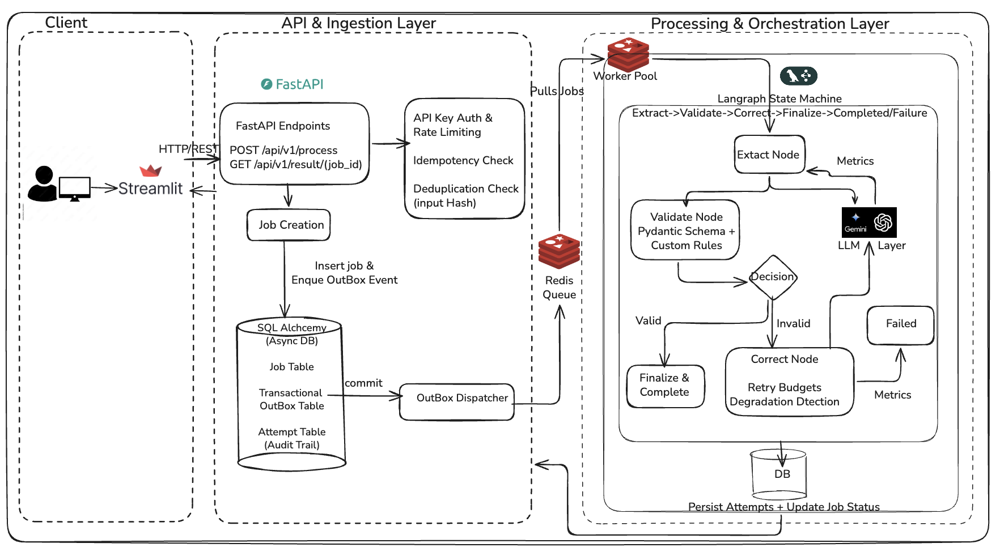

# 🔍 Self-Correcting Data Validation Agent

A production-ready backend AI workflow that extracts structured JSON from unstructured text using an LLM, validates it against strict Pydantic schemas, and automatically self-corrects until the output passes validation.

## Architecture



## Features

- **LangGraph orchestration** — state machine modelled as a directed graph with conditional edges
- **FastAPI** async backend with background job processing
- **Gemini Flash LLM** by default (OpenAI GPT-4 also supported)
- **Strict Pydantic validation** with logical consistency checks
- **Self-correction loop** — feeds validation errors back to the LLM (up to 3 retries)
- **SQLite storage** — original input, every attempt, errors, and final output
- **Observability** — token usage, latency, validation failure rate, retry counts
- **Streamlit UI** — paste text, select data type hint, view before/after, step counter, correction iterations

## Quick Start

### 1. Install dependencies

```bash
python -m venv .venv
source .venv/bin/activate
pip install -r requirements.txt
```

### 2. Configure environment

```bash
cp .env.example .env
# Edit .env — set your Gemini API key (default provider):
#   GEMINI_API_KEY=...
#   or switch to OpenAI:
#   LLM_PROVIDER=openai
#   OPENAI_API_KEY=sk-...
```

### 3. Start the API server

```bash
uvicorn app.main:app --reload --host 0.0.0.0 --port 8000
```

For local stability testing (recommended when seeing process exits), run without reload:

```bash
uvicorn app.main:app --host 0.0.0.0 --port 8000
```

Or use the provided stable launcher:

```bash
./scripts/start_api.sh
```

### 4. (Optional) Start the Streamlit UI

```bash
streamlit run frontend/app.py
```

Stable launcher:

```bash
./scripts/start_frontend.sh
```

## API Endpoints

| Method | Path | Description |
|--------|------|-------------|
| `POST` | `/api/v1/process` | Submit raw text for extraction |
| `GET` | `/api/v1/result/{job_id}` | Get job status & structured output |
| `GET` | `/api/v1/metrics` | Observability metrics |
| `GET` | `/health` | Health check |

### Example: Submit a job

```bash
curl -X POST http://localhost:8000/api/v1/process \
  -H "Content-Type: application/json" \
  -d '{"raw_text": "Invoice #INV-001\nDate: 2026-01-15\nFrom: Acme Corp\nTo: Widget Inc\nItems:\n1. Hosting - 2 x $100 = $200\nSubtotal: $200\nTax (10%): $20\nTotal: $220"}'
```

### Example: Get result

```bash
curl http://localhost:8000/api/v1/result/<job_id>
```

### Response shape

```json
{
  "job_id": "abc-123",
  "status": "COMPLETED",
  "validation_status": "VALID",
  "retry_count": 1,
  "structured_output": { "invoice_number": "INV-001", "..." : "..." },
  "correction_log": [
    {
      "attempt_number": 0,
      "is_valid": false,
      "validation_errors": "[subtotal] ...",
      "tokens_used": 512,
      "latency_ms": 2340
    },
    {
      "attempt_number": 1,
      "is_valid": true,
      "tokens_used": 480,
      "latency_ms": 2100
    }
  ],
  "total_tokens": 992,
  "total_latency_ms": 4440
}
```

## Supported Schemas

| Schema | Description |
|--------|-------------|
| `invoice` (default) | Invoices with line items, subtotal, tax, total |
| `survey` | Survey / form responses with scores |

Pass `"schema_name": "survey"` in the POST body to use an alternate schema.

## Project Structure

```
├── app/
│   ├── api/
│   │   └── routes.py          # FastAPI endpoints
│   ├── core/
│   │   └── config.py          # Settings (env vars)
│   ├── db/
│   │   ├── models.py          # SQLAlchemy ORM models
│   │   └── session.py         # Async engine & session factory
│   ├── llm/
│   │   ├── client.py          # OpenAI / Gemini unified client
│   │   └── prompts.py         # Prompt templates
│   ├── schemas/
│   │   ├── api_models.py      # Request / response models
│   │   └── data_schemas.py    # Target Pydantic schemas (invoice, survey)
│   ├── services/
│   │   ├── pipeline.py        # LangGraph state-machine orchestrator
│   │   └── validator.py       # Schema validation helper
│   ├── utils/
│   │   └── logging.py         # Structured logging & metrics
│   └── main.py                # FastAPI app entry-point
├── frontend/
│   └── app.py                 # Streamlit UI
├── tests/
│   ├── test_validation.py     # Validation unit tests
│   └── test_prompts.py        # Prompt builder tests
├── .env.example
├── .gitignore
├── requirements.txt
└── README.md
```

## Running Tests

```bash
pytest tests/ -v
```

## Design Decisions

- **Async everywhere** — FastAPI + SQLAlchemy async + async LLM clients. The main thread is never blocked during retries.
- **Background tasks** — `POST /process` returns immediately with a `job_id`; the pipeline runs in a FastAPI `BackgroundTask`.
- **Idempotent** — each job gets a UUID; re-fetching `/result/{id}` is safe and stateless.
- **Graceful error handling** — malformed JSON from the LLM is caught and fed back as a validation error; network failures are captured in the job record.
- **Extensible schemas** — add new Pydantic models to `SCHEMA_REGISTRY` in `data_schemas.py` to support new document types.

## Production Hardening Knobs

- `LLM_CONCURRENCY` (default `10`) — lowers memory pressure and API burstiness.
- `RATE_LIMIT_RPM` — now enforced via Redis-backed distributed limiter (with local fallback if Redis unavailable).
- `RETRY_BUDGET_PER_HOUR` — globally shared retry budget via Redis-backed sliding window.
- `REDIS_URL` + `USE_REDIS_QUEUE=true` — use dedicated worker queue for better reliability than app background tasks.

## Troubleshooting Exit 137

Exit `137` means the process received `SIGKILL` (often due to resource pressure or external kill/timeout).

Use this sequence:

1. Run without file watchers (`--reload` off):

```bash
./scripts/start_api.sh
```

2. Keep concurrency conservative:

```bash
LLM_CONCURRENCY=10 ./scripts/start_api.sh
```

3. Run API and frontend in separate terminals/tasks (don’t chain them in one command).

4. Free occupied ports before restart:

```bash
lsof -ti:8000 | xargs kill -9 2>/dev/null || true
lsof -ti:8501 | xargs kill -9 2>/dev/null || true
```

5. Verify health quickly:

```bash
curl -s http://localhost:8000/health | python3 -m json.tool
```
